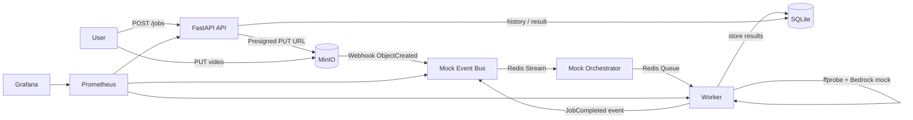

# Event-Driven Video Metadata Platform (EDVMP)

Production-grade reference repo showcasing Software Architect (AI/ML) system design: an event-driven, distributed pipeline that extracts video metadata and (optionally) calls Bedrock to generate a human summary.

## Business Problem
Teams that manage large video libraries (UGC, marketing, training) need reliable metadata extraction to power search, compliance checks, and downstream ML workflows. The system must be:
- Event-driven (uploads trigger processing automatically)
- Horizontally scalable (workers scale independently)
- Reliable (idempotency, retries, DLQ intelligence)
- Observable (metrics + dashboards)
- Secure-by-default (SAST/DAST, dependency and container scans)

## Architecture

### Local Mock Mode (no AWS creds)


### AWS Mode (Terraform deploy)
```mermaid
flowchart LR
  U[User] --> API[FastAPI on ECS Fargate]
  API -->|Presigned PUT URL| S3[(S3 Uploads)]
  S3 -->|ObjectCreated| EVB[EventBridge]
  EVB --> SFN[Step Functions]
  SFN -->|Idempotency (conditional write)| DDBI[(DynamoDB Idempotency)]
  SFN -->|SendMessage| SQS[(SQS Jobs)]
  SQS -->|poll| W[ECS Worker Service]
  W -->|store status| DDBJ[(DynamoDB Jobs)]
  W -->|store results| DDBR[(DynamoDB Results)]
  SQS -->|redrive| DLQ[(SQS DLQ)]
  SCH[EventBridge Schedule] -->|RunTask| ANA[DLQ Analyzer]
  ANA -->|incident JSON summary| CW[(CloudWatch Logs)]
```

## Core Workflow
1. `POST /jobs` → returns `job_id` + presigned S3 PUT URL.
2. User uploads video to S3/MinIO.
3. Upload triggers an event (S3→EventBridge in AWS; MinIO→Webhook in local).
4. Orchestration starts:
   - Idempotency guard (DynamoDB conditional write in AWS; SQLite uniqueness in local).
   - Enqueue processing.
5. Worker extracts metadata (ffprobe), optionally calls Bedrock (mock by default), stores results.
6. API serves job history and per-job results.

## Quickstart (Local Mode, <15 minutes)

Prereqs: Docker + Docker Compose, and `ffmpeg` installed on your machine (for the demo generator).

```bash
make up
```

Open:
- API: `http://localhost:8000/docs`
- MinIO console: `http://localhost:9001` (minioadmin/minioadmin)
- Prometheus: `http://localhost:9090`
- Grafana: `http://localhost:3000` (admin/admin)

Run the end-to-end demo:
```bash
make local-demo
```

Run full local E2E (starts and tears down docker-compose automatically):
```bash
make e2e
```

## AWS Deploy (Terraform)

Prereqs: AWS credentials, `aws` CLI, Docker, Terraform.

```bash
make deploy
```

Outputs include:
- API URL (ALB DNS)
- Uploads bucket name
- Generated demo credentials (Terraform outputs)

Destroy everything:
```bash
make destroy
```

## Observability

Metrics:
- API: `GET /metrics`
- Worker: Prometheus endpoint on port `9100` inside the compose network

SLO targets (starting point):
- Availability: 99.9% monthly for `GET /jobs/{id}` and `GET /jobs/{id}/result`
- Freshness: P95 job completion < 60s in local; < 5m in AWS (depends on video size and compute)
- Error budget: 0.1% monthly request error rate (5xx)

Grafana dashboard: `observability/grafana/dashboards/edvmp-overview.json`

## Reliability Engineering
- **Idempotency**: uses DynamoDB conditional writes in AWS; SQLite uniqueness in local.
- **Retries**: exponential backoff in worker; Step Functions retries SQS enqueue.
- **DLQ intelligence**: analyzer classifies failures and produces a structured incident JSON summary.

## Security & Supply Chain
CI includes:
- SAST: Bandit
- Dependency scan: pip-audit
- Container scan: Trivy
- DAST: OWASP ZAP baseline against the API

## Repo Tour
- `src/edvmp/api/` FastAPI service
- `src/edvmp/worker/` ECS/compose worker
- `src/edvmp/eventbus/` local mock event bus (MinIO webhook receiver)
- `src/edvmp/orchestrator/` local mock orchestrator (consumes event stream, enqueues work)
- `infra/terraform/` AWS deployment (S3, EventBridge, Step Functions, ECS, DynamoDB, SQS/DLQ, CloudWatch)
- `observability/` Prometheus + Grafana provisioning
- `runbooks/` On-call, rollback, DLQ triage
- `docs/system-design.md` deeper system design notes

## Demo Script (Recruiter-Friendly)
1. `make up`
2. `curl -X POST http://localhost:8000/auth/login ...` to obtain a token
3. `curl -X POST http://localhost:8000/jobs ...` to obtain a presigned upload URL
4. `curl -X PUT <upload_url> --upload-file samples/sample.mp4`
5. Poll `GET /jobs/{job_id}` until `SUCCEEDED`
6. Fetch `GET /jobs/{job_id}/result`
7. Open Grafana and show the dashboard panels (API requests, job success/failure)
