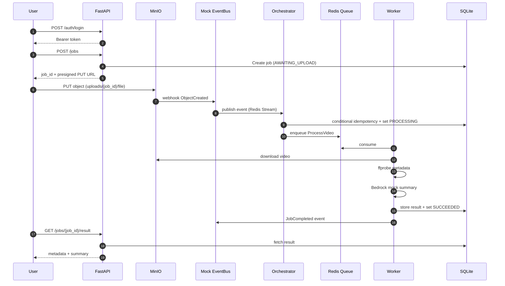
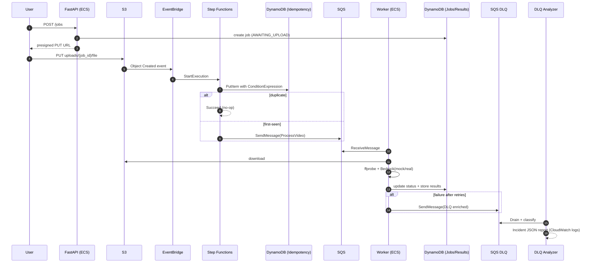

# System Design

## Goals
- Event-driven ingestion from video uploads
- Clear separation of concerns: API vs orchestration vs workers
- Built-in reliability patterns: idempotency, retries, DLQ classification
- Switch Bedrock mock → real Bedrock via config only

## Sequence Diagrams

### Local Mode

### AWS Mode

## Scaling Strategy
- Scale worker count horizontally (ECS Service desired count / autoscaling on SQS depth).
- Keep API stateless behind ALB; scale on request rate.
- DynamoDB PAY_PER_REQUEST supports bursty workloads; add adaptive capacity and alarm on throttles.

## Cost Model (Order-of-Magnitude)
- Main cost drivers: S3 storage + data transfer, ECS compute time, DynamoDB reads/writes, Step Functions transitions.
- Control levers:
  - Batch small videos to reduce overhead.
  - Tune worker CPU/memory for ffprobe workloads.
  - Use SQS long polling to reduce empty receives.

## Security Model
- JWT auth for API (rotate secret; store in Secrets Manager in real deployments).
- Principle of least privilege IAM roles (task runtime role only needs S3/DDB/SQS).
- CI gates: Bandit, pip-audit, Trivy, OWASP ZAP baseline.
- No secrets committed; use `.env` locally and Terraform outputs for AWS demo creds.

